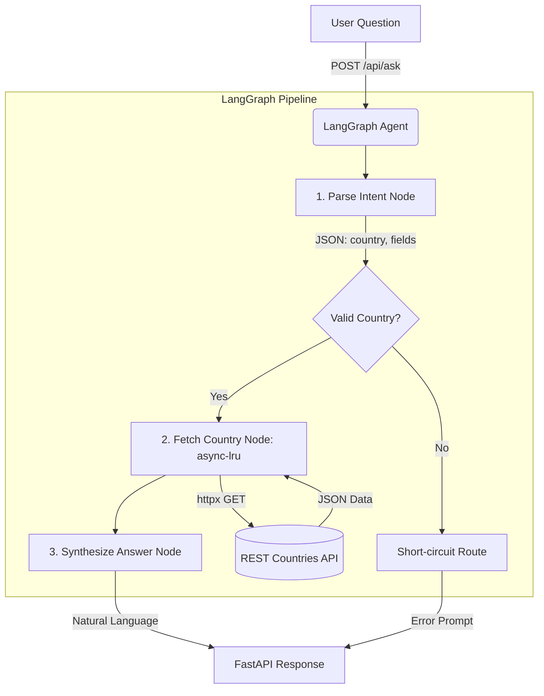

<div align="center">


# 🌍 Country Information AI Agent

A highly scalable, production-grade AI agent that answers natural-language questions about countries worldwide. Powered by **LangGraph**, **Groq AI**, and **FastAPI**.

[](https://www.python.org/downloads/)
[](https://fastapi.tiangolo.com)
[](https://python.langchain.com/docs/langgraph)
[](https://groq.com)

</div>

---

## 📖 Overview

The **Country Information AI Agent** is an intelligent web service that allows users to ask unstructured, natural-language questions about any country (e.g., *"What is the population and currency of Japan?"*) and receive accurate, grounded responses.

### ✨ Key Features
- **Strictly Grounded Data**: The LLM is structurally prevented from hallucinating. It strictly synthesizes answers based *only* on real-time data retrieved from the REST Countries API.
- **Micro-Latency API Caching**: Utilizes `async-lru` to cache upstream HTTP requests, reducing latency for repeated data fetches from ~800ms down to **~1ms**.
- **Resilient Error Handling**: Gracefully handles gibberish inputs, network timeouts, API 404s, and LLM rate-limits without crashing the server.
- **Premium UI**: Includes a responsive, dark-mode, glassmorphism chat interface built with pure vanilla HTML/CSS/JS (zero frontend bloat).

---

## 🏗️ Architecture Design

The project is built around a **3-Node LangGraph Pipeline**, ensuring an enforced separation of concerns between intent parsing, data retrieval, and natural language generation.



### 🧠 The Modules
1. **`parse_intent`** (Groq LLM): Extracts the target country and the specific data fields the user cares about (population, capital, continent, etc.).
2. **`fetch_country`** (Async HTTP): Connects to `restcountries.com`. It features timeout protection and in-memory LRU caching to prevent redundant upstream load.
3. **`synthesize_answer`** (Groq LLM): Takes the exact JSON payload from the API and crafts a conversational, highly formatted response for the user.

---

## 🚀 Getting Started

Follow these steps to get the server running on your local machine.

### Prerequisites
- Python 3.11 or higher
- [uv](https://docs.astral.sh/uv/) (Extremely fast Python package installer)
- A free [Groq API Key](https://console.groq.com)

### 1. Installation

1. **Clone or navigate to the repository:**
   ```bash
   cd c:\projects\Cloudeagle
   ```

2. **Sync the isolated environment using `uv`:**
   ```bash
   uv sync
   ```
   *This automatically creates a `.venv` and installs all dependencies specified in `pyproject.toml` (FastAPI, LangGraph, HTTPX, async-lru).*

### 2. Environment Configuration

The application requires an API key to communicate with the Groq inference engine.

1. Copy the example environment file:
   ```bash
   copy .env.example .env
   ```
2. Open `.env` and paste your Groq API Key:
   ```env
   GROQ_API_KEY=gsk_your_api_key_here
   ```

### 3. Run the Server (Locally)

Start the ASGI server using Uvicorn:

```bash
# If using uv, you can run uvicorn in your active virtual environment:
uvicorn main:app --reload --port 8000
```

*The `--reload` flag enables hot-reloading. Any changes to Python files will instantly restart the server.*

### 4. Run via Docker (Recommended for Hosting)

The project includes an optimized `Dockerfile` powered by `uv` for lightning-fast, reproducible builds.

```bash
# 1. Build the image
docker build -t country-agent .

# 2. Run the container (pass your API key)
docker run -p 8000:8000 --env GROQ_API_KEY=your_key_here country-agent
```

### 5. Open the Interface
Navigate your browser to:
👉 **[http://localhost:8000](http://localhost:8000)**

---

## 🔌 API Documentation

While the frontend provides a UI, you can also interact with the backend purely as an API service.

#### `POST /api/ask`
Processes a natural language query and returns the agent's synthesized response.

**Request Body:**
```json
{
  "question": "What is the capital and area of Brazil?"
}
```

**Response (200 OK):**
```json
{
  "answer": "The capital of Brazil is Brasília, and it covers a total area of 8,515,767 square kilometers.",
  "country": "Brazil",
  "flag_url": "https://flagcdn.com/w320/br.png",
  "error": null
}
```

---

## 🧪 Testing Edge Cases

The system is designed to gracefully handle partial data and invalid user state. Try these inputs to see the LangGraph conditional routing in action:

1. **Gibberish / No Country:** `"Tell me a joke about laptops."`
   *Result:* The pipeline realizes no country exists, halts the graph early, and politely asks the user to rephrase.
2. **Non-existent Country:** `"What is the capital of Atlantis?"`
   *Result:* The API fetch fails with a 404. The pipeline handles the HTTP exception and alerts the user about a potential typo.
3. **Island Nations (Missing Data):** `"What countries border Madagascar?"`
   *Result:* The API returns empty borders. The LLM gracefully synthesizes that Madagascar is an island nation with no borders.
4. **Repeated Queries:** Wait for the answer to `"Population of France?"` then ask `"Currency of France?"`.
   *Result:* The second answer generates almost instantly because the upstream API call is intercepted and resolved by the asynchronous LRU memory cache.

---

## 📂 Project Structure

```text
Cloudeagle/
├── agent/                  # Core AI Logic
│   ├── graph.py            # LangGraph StateGraph, edges, and routing
│   ├── nodes.py            # Async node functions (parsing, fetching, synthesizing)
│   └── state.py            # AgentState type schema definition
├── static/                 # Frontend Assets
│   ├── index.html          # Chat Interface UI
│   ├── script.js           # Client-side validation & DOM rendering
│   └── style.css           # Premium Dark Mode / Glassmorphism theme
├── main.py                 # FastAPI Application Factory & Endpoints
├── pyproject.toml          # PEP 621 Dependency definitions
└── .env                    # Secrets & API Keys
```

---

## 🛠️ Design Decisions (Production Readiness)

1. **No RAG / Pure Graph:** Because the data is highly structured and accessible via REST, generating vector embeddings would be unnecessary overhead. LangGraph enforces a determinable flow guaranteeing grounded facts.
2. **Stateless Backend:** The FastAPI endpoints hold no user state. All context is sent sequentially. This allows the backend to be horizontally scaled instantly via Kubernetes or AWS ECS.
3. **Frontend Separation:** The front end is strictly decoupled static HTML/JS/CSS served via a FastAPI mount. In a massive scale environment, these static files would be moved to an AWS S3 Bucket/CloudFront CDN, leaving FastAPI purely as an API compute layer.
4. **Timeouts:** The `httpx.AsyncClient` implements strict `10.0` second execution timeouts to prevent upstream REST Country outages from holding FastAPI's ASGI worker threads hostage.
